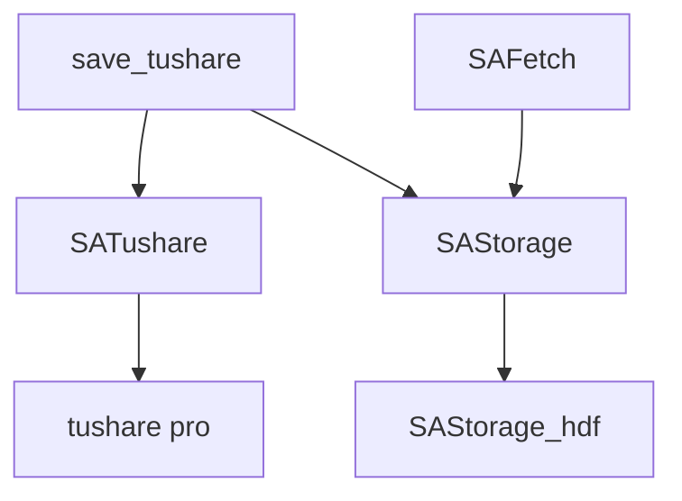

# 事由

数据本地化是不想依靠平台，万一哪天挂了没地方哭。

之前本地化是基于i问财，虽然获取的是自己最需要的一些数据，但是想进行一些别的分析的时候，数据并不足够。

重新再去下载也不是不可以，但是那个工作量就不是以小时计算，而是以天。

因此，想将完整的交易数据，财务数据本地化。

其实，不是没有现成的可以用。

QUANTAXIS 是一个不错的解决框架，写这个 Tushare 本地化也是参照了其中一些思路。

但是基于三点理由，没有直接使用 QUANTAXIS 而是自己另外写一个

1. QUANTAXIS 是一个通用框架，对我使用来说复杂了，很多模块用不上

2. QUANTAXIS 数据源有多种获取方式，但基本上是基于 tdx，tdx 有点不好的就是财务数据更新比较慢。QUANTAXIS Tushare 也有实现方式，但是只是部分。

3. QUANTAXIS 是用 mongodb 序列化，而我需要的是一个基于数据文件的序列化。

# 设计



- SATushare：通过 tushare pro 接口获取数据，封装基础验证、日期、代码等初步处理

- save_tushare：调用 SATushare 获取数据，通过 SAStorage 序列化到本地

- SAStorage_hdf：序列化实现方式

- SAFetch：从本地数据文件提取数据

采用日增量数据方式保存，如果要用其他序列化方式也很方便，增加对应的 SAStorage_XXXX

SAFetch 引用对应的 SAStorage_XXX 就可以了

同样的，要本地化其他数据源，增加 SAXXXX 和 save_XXXX 即可

# 实现（部分，我也没完全做完😭）

## 1. SAStorage_hdf

主要实现数据表的保存、读取等常规操作

#### 保存
```
def _save(data, table, append=False, **kwargs):
    """
    保持数据到文件
    
    Arguments:
        data    数据，Dataframe
        table 	表名
    """
    dp = "{}{}{}.hdf".format(data_path, os.sep, table)
    try:
        data.to_hdf(dp,
                    key=table,
                    format="table",
                    mode="a",
                    append=append,
                    data_columns=True,
                    **kwargs)
    except Exception as e:
        log_info(e)
```
#### 读取
```
def _load(table, **kwargs):
    """
    读取数据文件，返回df
    
    Arguments:
        table   表名
    Returns:
        dataframe
    """
    dp = "{}{}{}.hdf".format(data_path, os.sep, table)
    try:
        return pd.read_hdf(dp, key=table, mode="a", **kwargs)
    except Exception as e:
        log_info(e)
        return pd.DataFrame()
```
## 2. SATushare
一一对应 tushare pro 的[数据接口](https://tushare.pro/document/2)，并对获取结果进行一些操作，比如股票代码，日期统一处理

#### tushare pro 接口初始化
```
def set_token(token=None):
    try:
        if token is None:
            token = SASETTING.get_config("tushare", "token", None)
        else:
            SASETTING.set_config("tushare", "token", token)
        ts.set_token(token)
    except Exception as e:
        if token is None:
            print("请设置tushare的token")
        else:
            print("请升级tushare 至最新版本 pip install tushare -U")
        print(e)


def get_pro():
    try:
        set_token()
        pro = ts.pro_api()
    except Exception as e:
        if isinstance(e, NameError):
            print("请设置tushare pro的token凭证码")
        else:
            print("请升级tushare 至最新版本 pip install tushare -U")
            print(e)
        pro = None
    return pro
```
#### 获取交易日历
```
def get_trade_cal(exchange="SSE",
                  start_date="19901219",
                  end_date="20190101",
                  is_open=""):
    """
    获取各大交易所交易日历数据,默认提取的是上交所

    Arguments:
        exchange 	str 	N 	交易所 SSE上交所 SZSE深交所
        start_date 	str 	N 	开始日期
        end_date 	str 	N 	结束日期
        is_open 	str 	N 	是否交易 '0'休市 '1'交易

    Returns:
        exchange 	str 	Y 	交易所 SSE上交所 SZSE深交所
        cal_date 	str 	Y 	日历日期
        is_open 	str 	Y 	是否交易 0休市 1交易
        pretrade_date 	str 	N 	上一个交易日
    """

    def _get_trade_cal():
        log_info("正在下载交易日历...")
        try:
            pro = get_pro()
            data = pro.trade_cal(
                start_date=start_date,
                end_date=end_date,
                exchange=exchange,
                is_open=is_open,
                fields="exchange, cal_date, is_open, pretrade_date")
            log_info("下载交易日历 TRADE_DATE {}-{} 成功".format(start_date, end_date))
        except Exception as e:
            print(e)
            log_info(e)
            time.sleep(1)
            data = _get_trade_cal()
        return data

    return _get_trade_cal()
  ```

#### 获取每日指标
```
def get_daily_basic(ts_code="", trade_date="", start_date="", end_date=""):
    """
    更新时间：交易日每日15点～17点之间
    描述：获取全部股票每日重要的基本面指标，可用于选股分析、报表展示等。

    Arguments:
        ts_code 	str 	N 	股票代码（二选一）
        trade_date 	str 	N 	交易日期（二选一）
        start_date 	str 	N 	开始日期(YYYYMMDD)
        end_date 	str 	N 	结束日期(YYYYMMDD)

    Returns:
        ts_code 	str 	TS股票代码
        trade_date 	str 	交易日期
        close 	float 	当日收盘价
        turnover_rate 	float 	换手率（%）
        turnover_rate_f 	float 	换手率（自由流通股）
        volume_ratio 	float 	量比
        pe 	float 	市盈率（总市值/净利润）
        pe_ttm 	float 	市盈率（TTM）
        pb 	float 	市净率（总市值/净资产）
        ps 	float 	市销率
        ps_ttm 	float 	市销率（TTM）
        total_share 	float 	总股本 （万股）
        float_share 	float 	流通股本 （万股）
        free_share 	float 	自由流通股本 （万）
        total_mv 	float 	总市值 （万元）
        circ_mv 	float 	流通市值（万元）
    """

    def _get_daily_basic():
        log_info("正在下载每日指标数据...")
        try:
            pro = get_pro()
            data = pro.daily_basic(
                ts_code=ts_code,
                trade_date=trade_date,
                start_date=start_date,
                end_date=end_date,
                fields=
                " ts_code, trade_date, close, turnover_rate, turnover_rate_f, volume_ratio, pe, pe_ttm, pb, ps, ps_ttm, total_share, float_share, free_share, total_mv, circ_mv"
            )
            log_info("下载每日指标数据 DAILY_BASIC #{} 成功".format(trade_date))
        except Exception as e:
            print(e)
            log_info(e)
            time.sleep(1)
            data = _get_daily_basic()
        return data

    return _get_daily_basic()
```
其他如此类推

## 3. SAFetch
读取本地数据，很简单，一个表一个

```
def SA_get_stock_basic(**kwargs):
    return _load("STOCK_BASIC", **kwargs)


def SA_get_trade_cal(**kwargs):
    return _load("TRADE_CAL", **kwargs)


def SA_get_stock_daily(**kwargs):
    return _load("STOCK_DAILY",**kwargs)


def SA_get_daily_basic(**kwargs):
    return _load("DAILY_BASIC", **kwargs)


def SA_get_index_daily(**kwargs):
    return _load("INDEX_DAILY", **kwargs)

def SA_get_index_basic(**kwargs):
    return _load("INDEX_BASIC", **kwargs)

def SA_get_trade_date(start_date, end_date):
    df = SA_get_trade_cal()

    if len(df) > 0:
        return df["cal_date"][(df["cal_date"] >= start_date)
                              & (df["cal_date"] <= end_date) &
                              (df["is_open"] == 1)]
```

## 4. save_tushare
执行本地化

#### 将交易日历存到本地文件表 TRADE_CAL
```
def save_trade_cal():
    df = SA_get_trade_cal()

    # 这个数据并不是很大，所以不采用增量方式保存，直接覆盖
    # 获取最后一个时间
    # if len(df) > 0:
    #     start_date = df["cal_date"].iloc[-1].replace('-', '')
    # else:
    #     start_date = "19901219"

    # 2000-01-01 => 20000101
    end_date = today_str().replace('-', '')

    df = get_trade_cal(end_date=end_date)
    _save(df, table="TRADE_CAL")
```

#### 日线行情和每日指标
```
def save_stock_daily():
    df_stock_daily = SA_get_stock_daily()
    # 获取最后一个记录时间
    if len(df_stock_daily) > 0:
        start_date = df_stock_daily["trade_date"].iloc[-1].replace('-', '')
    else:
        start_date = "19901219"

    end_date = today_str().replace('-', '')

    trade_date = SA_get_trade_date(start_date, end_date)
    log_info("准备下载{}-{}日线行情数据...".format(start_date, end_date))
    for date in trade_date:
        df = get_stock_daily(trade_date=date)
        _save(df, table="STOCK_DAILY", append=True)
    log_info("下载{}-{}日线行情数据完成".format(start_date, end_date))


def save_daily_basic():
    df_daily_basic = SA_get_daily_basic()
    # 获取最后一个记录时间
    if len(df_daily_basic) > 0:
        start_date = df_daily_basic["trade_date"].iloc[-1].replace('-', '')
    else:
        start_date = "19901219"

    end_date = today_str().replace('-', '')

    trade_date = SA_get_trade_date(start_date, end_date)
    log_info("准备下载{}-{}每日指标数据...".format(start_date, end_date))
    for date in trade_date:
        df = get_daily_basic(trade_date=date)
        df = df.fillna(0.00)
        _save(df, table="DAILY_BASIC", append=True)
    log_info("下载{}-{}每日指标数据完成".format(start_date, end_date))
```
## 5. 本地化结果


现在只是实现了其中6个接口，历史日线数据大概是 1G

财务数据接口还没写好

# TODO

- Tushare Pro 的其他接口实现

- 获取数据后的统一处理还没写的

- 由于数据跟之前不一样了，前端要改

- 还没想到。。。。